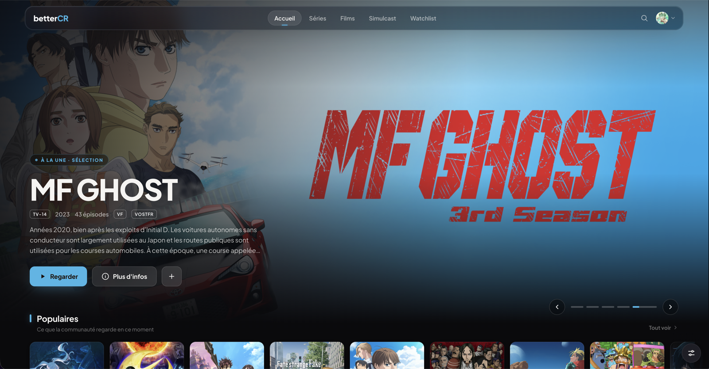
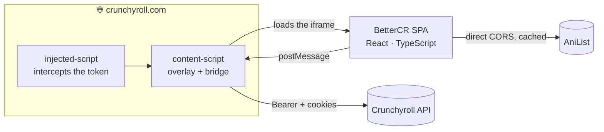

<div align="center">


# better<kbd>CR</kbd>

#### A complete redesign of Crunchyroll, right in your browser.

A **Chrome (Manifest V3)** extension in **TypeScript**, with **no backend**: it reskins
`crunchyroll.com` with a faster, prettier interface, powered by the **real Crunchyroll API**
and enriched with **AniList**.

<br/>

[](https://github.com/JeremGamingYT/BetterCrunchyroll/stargazers)
[](https://github.com/JeremGamingYT/BetterCrunchyroll/network/members)
[](https://github.com/JeremGamingYT/BetterCrunchyroll/issues)
[](https://github.com/JeremGamingYT/BetterCrunchyroll/commits)

[](#)
[](#)
[](#)
[](#)

<br/>

[🇫🇷 Français](README.md)  •  🇬🇧 **English**

</div>

---

## 🖼️ Preview

<div align="center">



</div>

---

## 🎬 What is it?

**BetterCR** takes over Crunchyroll's UI and replaces it with a rethought design — without
leaving the site or relying on a server. You stay signed into **your own account**; your data
stays with you / Crunchyroll.

> ⚡ Faster, cleaner, prettier · 🧠 AniList-enriched · 🙈 spoiler-free · 🌍 EN & FR

## ✨ Features

| | |
| --- | --- |
| 🎨 **Full redesign** | Home, catalog, series page, search, watchlist, profile |
| 🌍 **Bilingual EN / FR** | Instant switch + localized content via the API |
| 🔐 **Real session** | Reuses your Crunchyroll login · **real** login & logout |
| 🅰️ **AniList enrichment** | Banners, HD covers, scores, genres, studios |
| 🙈 **Anti-spoiler** | Unwatched episodes' thumbnails & titles blurred |
| 📡 **Sorted simulcast** | By most recently added / updated episode |
| ❤️ **Watchlist & favorites** | **Real** add / remove + local favorites |
| 📊 **Profile & stats** | Real name, avatar and watch statistics |
| 💾 **Smart cache** | External APIs (AniList) are cached |
| ⚡ **No backend** | 100% bundled inside the extension |

## 🧩 Architecture



The React app is served **from the extension** (no server). Since the iframe can't call the CR
API directly (CORS), everything is proxied through the content script, which holds the session
token. The native (DRM) video player is kept.

## 🧰 Stack

`strict TypeScript` · `React 18` · `Vite + @crxjs` · `zod` · `ESLint + Prettier`
Layered architecture inspired by **NASA's Power-of-Ten** rules & the **Google TS Style Guide**.

## 🚀 Install

```bash
cd BetterCR
npm install
npm run build          # builds dist/
```

1. Open `chrome://extensions`
2. Enable **Developer mode**
3. **Load unpacked** → the `BetterCR/dist` folder
4. Visit **crunchyroll.com** (signed in)

## 🔒 Privacy

No backend, no trackers. Your session token never leaves the browser; calls go **directly** to
Crunchyroll (with your cookies) and AniList.

## 🤝 Transparency

Yes, BetterCR is largely *vibe-coded* (built with AI assistance). But it's a project that is
**supervised, reviewed, tested and maintained by a human developer**. Every release goes through a
build, lint and an audit (security, dead code, minimal permissions) before shipping, and fixes land
fast. AI speeds up the work; the decisions, architecture and quality stay human. And since it's all
**open-source**, you can verify it yourself.

## ⚠️ Disclaimer

An **independent** project, not affiliated with Crunchyroll. "Crunchyroll" belongs to its
respective owners. For personal use.

<div align="center"><br/>Made with 🧡 — <code>better<b>CR</b></code></div>
