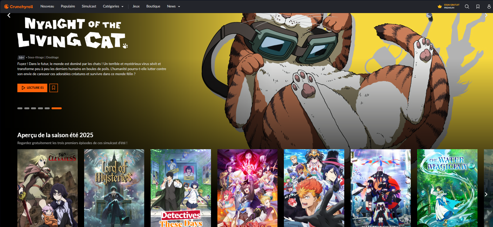
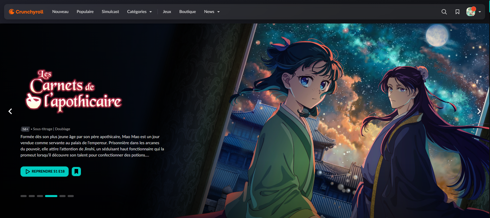

# ✨ BetterCrunchyroll – Modern & Rounded Crunchyroll UI

[](https://github.com/JeremGamingYT/BetterCrunchyroll)
[](#installation)
[](LICENSE)

> Transform Crunchyroll with a **sleek**, **rounded**, and **modern** dark theme, smooth animations, and extra binge-watching tools.

---

## 📸 Before / After
<p align="center">
  
  &nbsp;&nbsp;
  
</p>

---

## 🎯 Why install it?
- **Modern look** – Rounded corners, glass effect, smooth animations.
- **Extra features** – Picture-in-Picture, intro/outro auto-skip, auto-next.
- **Customizable** – Accent color and corner radius.
- **Safe & legal** – Pure client-side CSS/JS injection.

---

## 🛠 Key Features
| Category | Feature | Description |
|----------|---------|-------------|
| **UI** | Dark & glass theme | Translucent cards, rounded corners, soft shadows. |
| | Dynamic accent color | Fully customizable via settings. |
| | Auto-hide navbar | More screen space for anime. |
| **Player** | Picture-in-Picture | Native PiP button + `Ctrl/⌘+P` shortcut. |
| | Auto-Skip | Skips intros/outros automatically. |
| | Auto-Next | Plays the next episode without clicks. |
| **Cards & Calendar** | Rounded posters | Cleaner, modern visuals. |
| | Hover lift | Smooth floating effect on hover. |

---

## 🚀 Installation
### 📦 Quick method
1. Download or clone the project:
   ```bash
   git clone https://github.com/JeremGamingYT/BetterCrunchyroll.git
   ```
  2. Open `chrome://extensions` (or `edge://extensions`).
  3. Enable **Developer mode**.
  4. Click **Load unpacked** and select the project folder.
> Compatible with Chrome & Edge (Firefox support planned).

---

## 🎨 Customization

Inside the popup settings:

* Change **Accent Color** (affects all orange elements)
* Set **Corner Radius**
* Toggles for: Colored Titles, Auto-Hide Header, Auto-Skip, Auto-Next

---

## 📢 Contribute & Share

* Report bugs or suggest features via [Issues](https://github.com/JeremGamingYT/BetterCrunchyroll/issues).
* Pull Requests welcome – fork, create a branch, open a PR.
* Share screenshots on **Twitter/X**, **Reddit**, or **Discord** with `#BetterCrunchyroll`.

---

## ⚖️ Legal

BetterCrunchyroll is an **independent** project and is not affiliated with Crunchyroll LLC.
It does **not** host, stream, download, or bypass DRM.
All styling changes happen client-side and do not alter Crunchyroll’s servers.
