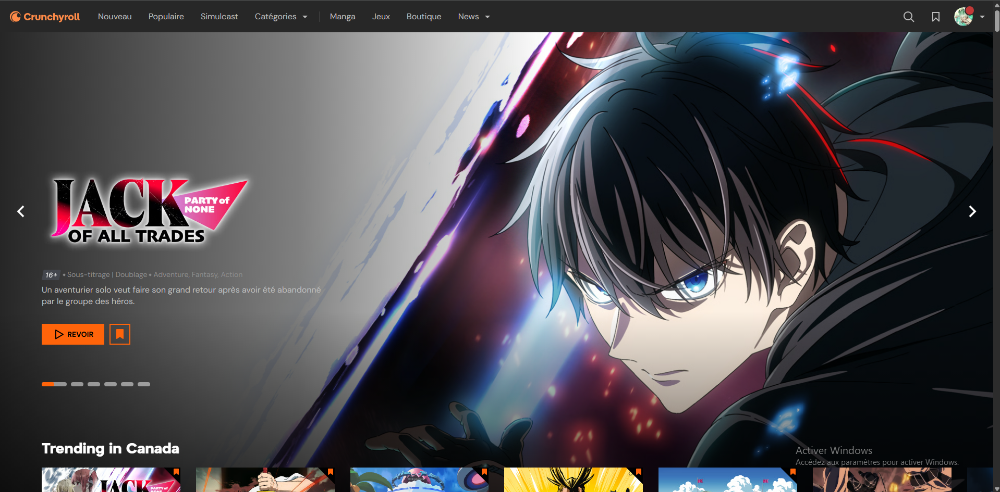

<div align="center">


# 🎌 BetterCrunchyroll

### Premium UI & UX Redesign for Crunchyroll — Chrome Extension

**A complete, modern and high-end reimagination of Crunchyroll.**  
Designed to feel faster, cleaner, smoother and more immersive.

[](#)
[](#)
[](LICENSE)

</div>

## ⚠️ Important Notice

> **DO NOT DOWNLOAD THE SOURCE CODE YET**
>
> The project is currently undergoing **major internal restructuring**.  
> The `main` branch contains unstable code and known breaking issues.
>
> **Project update:** the extension has been **massively reworked** over the last few weeks.  
> It is no longer close to the older builds — it now behaves much more like a complete custom site, powered by **multiple APIs**, while I keep fixing bugs and improving the experience everywhere.
>
> 👉 **Only download official builds from the `Releases` section**.

---

---

## 📸 Visual Comparison — Before / After

This section illustrates the interface transformation introduced by **BetterCrunchyroll**.

Each comparison highlights structural clarity, visual hierarchy improvements, spacing refinement, and immersion upgrades.

---

### 🏠 Home — Discover Page

| Before (Official Crunchyroll) | After (BetterCrunchyroll) |
|--------------------------------|----------------------------|
|  | |

### 🎞️ Anime / Series Page

| Before | After |
|--------|--------|
|  |  |


### 🆕 Latest / Popular Listing

| Before | After |
|--------|--------|
|  |  |

### 📅 Simulcast Page

| Before | After |
|--------|--------|
|  |  |

---

## 🔥 Features — Project Status

### Currently Implemented

- [V] **COMPLETE Crunchyroll Redesign**  
  A fully rebuilt platform with a brand-new UI, independent from the original Crunchyroll interface.

- [V] **All anime properly displayed**  
  Series, episodes, images, metadata and schedules are fully supported.

- [V] **Removal of unnecessary Crunchyroll sections**  
  Clean and focused home page without redundant or outdated blocks.

- [V] **Modern, fluid and premium UI**  
  Rounded design, smooth animations, refined transitions and a new typography system.

- [V] **Dynamic visual identity per anime**  
  Colors, borders, buttons, titles and glow effects adapt to each show.

- [V] **Enriched anime pages**  
  Characters, cast, detailed descriptions, images, episode lists,  
  upcoming episodes with **release dates displayed directly**.

---

### ⏳ In Progress / Planned

- [X] **Comments system powered by AniList**  
  Community features reintroduced through native AniList integration.

- [X] **Native notifications (Desktop & Mobile)**  
  New episodes, upcoming releases and community activity alerts.

- [X] **Full mobile compatibility**  
  Responsive layout with future PWA support.

- [X] **Advanced user profiles**  
  Avatars, banners, identity linked to AniList and comment history.

- [X] **Automatic subtitle translation**  
  Google Translate by default  
  Optional AI-based translation via API key (advanced models).

---

## ✨ Project Overview

**BetterCrunchyroll** is a **premium Chrome extension** that completely replaces the official Crunchyroll website interface with a modern, fluid and immersive experience.

This is **not a theme**, not a simple CSS tweak.  
It is a **full React application** injected over Crunchyroll, replacing every page.

**Goal:**  
> Deliver a next-gen anime streaming interface worthy of 2025 standards.

---

## 🎨 Design Philosophy

- Apple-like clarity and hierarchy
- Netflix-grade immersion
- Smooth animations
- Dark-first, eye-friendly UI
- No visual noise, no clutter

### Visual Highlights
- Glassmorphism navigation
- Soft blur & depth layers
- Fluid micro-interactions
- Premium typography (Outfit)
- Carefully tuned spacing & motion curves

---

## 🚀 Key Features

### 🎨 Complete Premium Redesign
- Fully custom UI (no Crunchyroll CSS left)
- Modern design system
- Dark mode optimized by default
- Smooth transitions and hover states
- High-performance rendering

### 🔖 Watchlist System
- Fully functional **Add to List** button
- Live synchronization with Crunchyroll account
- Dynamic button state (ADD / IN MY LIST)
- Animated bookmark icon
- Custom visual feedback when added

### 🔗 AniList Integration (Ready)
- AniList button on anime pages
- Official SVG logo
- Backend-ready (future real sync)

### 📄 Smart Pagination
- “Load More” system on Latest & Popular pages
- +10 anime per click
- Smooth loading animation
- Smart cache (15–30 min)

---

## 📺 Pages Included

### 🏠 Home (Discover)
- Auto-animated hero carousel
- Multiple horizontal anime rows
- Premium card hover effects
- Smooth scrolling experience

### 🎞️ Anime / Series Page
- Immersive hero header
- Functional Watchlist button
- AniList button (coming soon)
- Season selector with instant loading
- Episode grid with thumbnails
- No double-click issues
- Real Premium badge logic

### 🆕 Latest & ⭐ Popular
- Initial load: 24 items
- Load more system
- Performance-friendly pagination

### 📅 Simulcast
- Correct seasonal filtering
- Weekly calendar layout
- Only real simulcasts shown

---

## 🧭 Navigation Structure

Navigation order (intentional & curated):

1. Latest  
2. Popular  
3. Simulcast  
4. Categories  
5. Manga  
6. Games  
7. Store  
8. News  

---

## 🛠️ Tech Stack

| Category | Technologies |
|--------|-------------|
| Frontend | React 19, TypeScript |
| Build | Vite, ESBuild |
| Styling | SCSS, CSS Variables |
| Animations | Framer Motion |
| Icons | Lucide React |
| Routing | React Router v6 |
| Extension | Chrome Manifest V3 |

---

## 🧠 How It Works

1. **Content Script** injects on Crunchyroll pages
2. Original site content is fully removed
3. React application is mounted
4. Navigation is internally rerouted
5. Crunchyroll becomes transparent to the user

**Result:**  
A seamless replacement — no reload, no iframe, no hacks.

---

## 📁 Project Structure

```text
BetterCrunchyroll/
├── src/
│   ├── components/
│   ├── pages/
│   ├── styles/
│   └── App.tsx
├── public/
│   ├── manifest.json
│   ├── content.js
│   ├── popup.html
│   └── icons/
├── dist/
└── vite.config.ts
````

---

## 🐛 Major Fixes (v1.1.0)

* ✔ Watchlist button fully functional
* ✔ Navigation back logic fixed
* ✔ Instant season loading
* ✔ Correct simulcast filtering
* ✔ Pagination added to large lists

---

## 📊 Performance

* Build size: ~358 KB (gzip ~116 KB)
* First paint: < 1s
* Constant 60 FPS animations
* Lazy-loaded images
* Reduced API calls (-60%)

---

## 🗺️ Roadmap

### v1.x

* Custom video player
* Real AniList sync
* Advanced watch history

### v2.0

* Light mode
* Multi-language (FR / EN / JP)
* PWA support
* Offline browsing

---

## 🤝 Contributing

Contributions are welcome **once the project stabilizes**.

```bash
git clone https://github.com/your-username/bettercrunchyroll
git checkout -b feature/your-feature
git commit -m "Add amazing feature"
git push origin feature/your-feature
```

---

## 📄 License

MIT License — see `LICENSE`

---

## ⚖️ Legal Disclaimer

This project is a **conceptual redesign** made for educational and demonstrative purposes.
It is **not affiliated** with Crunchyroll, Sony, or any related entity.

All trademarks belong to their respective owners.

---

<div align="center">

**Better design.
Better experience.
Better anime.**

✨

</div>
