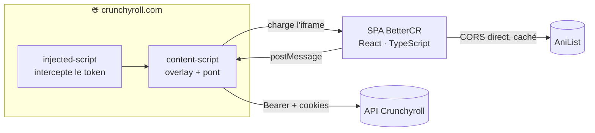

<div align="center">


# better<kbd>CR</kbd>

#### Une refonte complète de Crunchyroll, directement dans votre navigateur.

Extension **Chrome (Manifest V3)** en **TypeScript**, **sans backend** : elle redessine
`crunchyroll.com` avec une interface plus rapide et plus belle, branchée sur la **vraie API
Crunchyroll** et enrichie par **AniList**.

<br/>

[](https://github.com/JeremGamingYT/BetterCrunchyroll/stargazers)
[](https://github.com/JeremGamingYT/BetterCrunchyroll/network/members)
[](https://github.com/JeremGamingYT/BetterCrunchyroll/issues)
[](https://github.com/JeremGamingYT/BetterCrunchyroll/commits)

[](#)
[](#)
[](#)
[](#)

<br/>

🇫🇷 **Français**  •  [🇬🇧 English](README.en.md)

</div>

---

## 🖼️ Aperçu

<div align="center">


</div>

---

## 🎬 C'est quoi ?

**BetterCR** prend le contrôle de l'interface de Crunchyroll et la remplace par un design
repensé — sans quitter le site ni dépendre d'un serveur. Vous restez connecté à **votre
compte** ; vos données restent chez vous / chez Crunchyroll.

> ⚡ Plus rapide, plus lisible, plus beau · 🧠 enrichi par AniList · 🙈 zéro spoiler · 🌍 FR & EN

## ✨ Fonctionnalités

| | |
| --- | --- |
| 🎨 **Refonte complète** | Accueil, catalogue, fiche série, recherche, watchlist, profil |
| 🌍 **Bilingue FR / EN** | Bascule instantanée + contenu localisé via l'API |
| 🔐 **Vraie session** | Réutilise votre connexion Crunchyroll · login & **déconnexion réels** |
| 🅰️ **Enrichissement AniList** | Bannières, jaquettes HD, notes, genres, studios |
| 🙈 **Anti-spoiler** | Miniatures & titres des épisodes non vus floutés |
| 📡 **Simulcast trié** | Par épisode le plus récemment ajouté / mis à jour |
| ❤️ **Watchlist & favoris** | Ajout / retrait **réels** + favoris locaux |
| 📊 **Profil & stats** | Nom, avatar et statistiques de visionnage réels |
| 💾 **Cache intelligent** | Les API externes (AniList) sont mises en cache |
| ⚡ **Sans backend** | 100 % embarqué dans l'extension |
| 🛟 **Résilience** | *Kill switch* : repli auto vers le site natif si Crunchyroll change (drapeau distant + auto-détection) |

## 🧩 Architecture


```mermaid
flowchart LR
  subgraph P["🌐 crunchyroll.com"]
    INJ["injected-script<br/>intercepte le token"]
    CS["content-script<br/>overlay + pont"]
  end
  APP["SPA BetterCR<br/>React · TypeScript"]
  CR[("API Crunchyroll")]
  ANI[("AniList")]
  INJ --> CS
  CS -->|charge l'iframe| APP
  APP -->|postMessage| CS
  CS -->|Bearer + cookies| CR
  APP -->|CORS direct, caché| ANI
```

L'app React est servie **depuis l'extension** (aucun serveur). L'iframe ne pouvant pas appeler
l'API CR directement (CORS), tout passe par le content-script qui détient le token de session.
Le lecteur vidéo natif (DRM) est conservé.

## 🧰 Stack

`TypeScript strict` · `React 18` · `Vite + @crxjs` · `zod` · `ESLint + Prettier`
Architecture en couches inspirée des règles **NASA Power-of-Ten** & du **Google TS Style Guide**.

## 🚀 Installation

```bash
cd BetterCR
npm install
npm run build          # génère dist/
```

1. Ouvrez `chrome://extensions`
2. Activez le **Mode développeur**
3. **Charger l'extension non empaquetée** → dossier `BetterCR/dist`
4. Rendez-vous sur **crunchyroll.com** (connecté)

## 🔒 Confidentialité

Aucun backend, aucun tracker. Votre token de session ne quitte jamais le navigateur ; les
appels vont **directement** à Crunchyroll (avec vos cookies) et à AniList.

## 🤝 Transparence

Oui, BetterCR est en grande partie *vibe-codé* (développé avec l'aide de l'IA). Mais c'est un projet
**supervisé, relu, testé et maintenu par un humain développeur**. Chaque version passe par un build,
du lint et un audit (sécurité, code mort, permissions minimales) avant publication, et les correctifs
arrivent vite. L'IA accélère le développement ; les décisions, l'architecture et la qualité restent
humaines. Et comme tout est **open-source**, vous pouvez le vérifier par vous-même.

## 🗺️ Feuille de route

- [x] Accueil · Catalogue · Fiche série · Recherche
- [x] i18n FR/EN · Profil & stats réels · Watchlist & favoris
- [x] Anti-spoiler · Simulcast trié · Enrichissement AniList
- [x] Continuer à regarder · Parcourir par genre · Connexion/déconnexion réelles
- [x] **Page Lecteur BetterCR** autour du lecteur natif (infos · épisodes · *À suivre*)
- [x] **Commentaires par épisode** (avatars · réponses · édition/suppression · temps réel · filtre FR/EN)
- [x] **Anti-spoiler des commentaires** · expiration 30 j · **éviction intelligente**
- [x] **Modération communautaire** (signalement · score de confiance · auto-hide · shadow-ban · cooldown · mots masqués)
- [x] **Centre de notifications** (réponses + nouveaux épisodes du jour) · **Sorties à venir** (AniList)
- [x] **Découvertes** (recommandations personnalisées) · **Recherche avancée** (genre · saison · format · VF/VOSTFR)
- [x] **Stats enrichies** (heures/mois · genres · streak · Top 10) · **Secours multi-API** (AniList → MAL → Kitsu)
- [x] **Lecteur natif reskinné** (cadre + contrôles teintés à l'accent ; saut intro/générique natif de CR conservé)
- [x] **Kill switch intelligent** (repli gracieux vers le CR natif si Crunchyroll change : drapeau distant + auto-détection + reprise auto)
- [x] **Outil de capture d'API** (`BetterCR/tools/cr-dumper`) pour suivre les changements de Crunchyroll et mettre à jour vite
- [ ] Publication sur le Chrome Web Store

## ⚠️ Avertissement

Projet **indépendant**, non affilié à Crunchyroll. « Crunchyroll » appartient à ses détenteurs
respectifs. À usage personnel.

<div align="center"><br/>Fait avec 🧡 — <code>better<b>CR</b></code></div>
